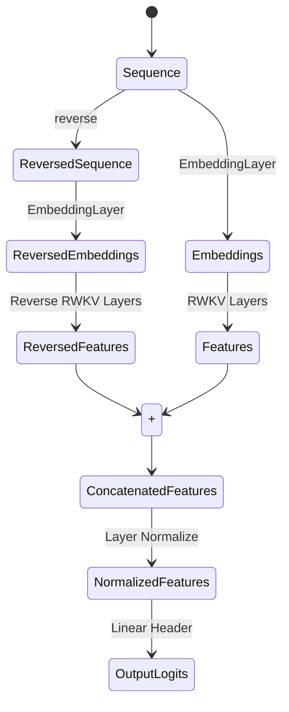
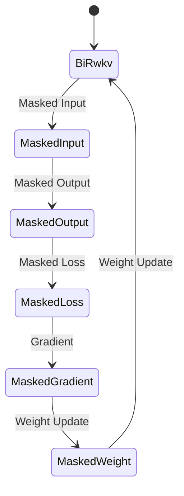

# BiRWKV Encoders

## Introduction

RWKV is a RNN structure which can be used to predict next word. The RWKV model limits the model to encode the whole sequence from the beginning to the end. In this project, we propose a new model BiRWKV which can encode the sequence from both sides.

## Model Stucture

The basic idea of the BiRWKV is to use two RWKV models to encode the sequence from both sides. The model structure is shown in the following figure.

## Model Training

### MLM Model Training

The MLM model is used to train the model with masked language model task. The masked language model task is to predict the masked words. The masked words are replaced with a special token, and the model is trained to predict the original words. The training process is shown in the following figure.

The script src/create_mlm_datasets.py is to create a masked datasets. The script train_mlm.py is to train the pretrained mlm bi-rwkv model.

