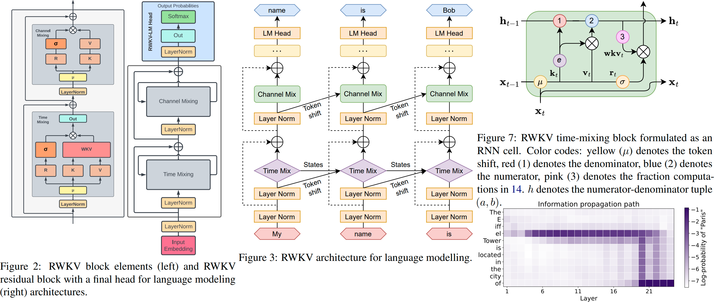

# 使用MPS（Metal Performance Shaders）扩展支持RWKV-v5在Mac上的训练和预测

## 为什么是RWKV？

RWKV简单说，是一个具有Transformer并行训练特性的RNN网络。和传统的RNN不同，RWKV克服了RNN的以下几个问题：

- 训练速度慢。由于RNN的特性，每个时间步的计算都是串行的，无法并行化，导致训练速度慢。
- 网络深度增加，训练容易发生梯度消失和梯度爆炸，训练难度大。

而RWKV则保留了RNN的天然具备时序特征的前提下，通过一系列改造，让其具备了和Transformer一样的并行训练特性。而由于其天生的时序特性，让Transformer各种绞尽脑汁的位置编码们失去了用武之地。同时，RNN的运行效率远超Transformer，在运行时理论上可以有无限的上下文长度。

在Transformers当今对计算资源无限贪婪地抢占内卷的前提下，回头看更加符合第一性原则的RNN，RWKV看起来是一个更加合理的选择。而且RWKV从头到尾都是国人主导的架构，在当下的环境下，更应该被我们重视。

## 为什么要用MPS扩展RWKV？

RWKV通过以下几个技巧，让一个RNN网络能够支持并行训练。

1. 通过把一层拆成多个模块（Time Mixing/Channel Mixing），相当于Transformer的Attention和FFN，让不同层的各个模块可以以Cascading的模式分别并行计算。
2. 在Attention层，虽然前后时间状态是相互依赖的，但同一步数时间衰退参数是线性的，可以通过在每个时间步骤上不同位置的参数并行独立计算，增加并行度。
3. 在FFN层，虽然前后时间状态是相互依赖的，但FFN需要的前序时间状态在Attention层已经计算出来可以复用，因此FFN层在Attention层计算完成之后，可以并行计算。

在预测的时候，对于批量输入的Context，通过把Context切分成合适大小，可以在有限的显存下，分批计算当前Context的输出，然后再逐个输出。几乎可以在任何显卡上运行，接受无限长度的输入和输出。这一点让在kv-cache上米粒上绣花的Transformers群体黯然失色。

由于当前RWKV的官方实现，训练代码还是严重依赖CUDA，在Nvidia被禁运的今天，把RWKV能平移到别的平台上就显得很有意义。目前我自己能拿到手的非CUDA体系，就是苹果的MPS系列了。最高档次的Mac Studio拥有高达192GB的统一内存，售价和Nvidia H100比起来相当于不要钱。让我们在消费级电子产品，有了自己训练/调优大语言模型的可能。而到了明年，国产的算力卡的大规模上市，让我们移植CUDA的操作，变得更加有意义了。

所以使用MPS扩展RWKV并不是真的要在Mac Studio上训练一个LLM，而是为明年开始国产生态做一个练手准备。

所幸的是，RWKV在Pytorch平台上，仅需要在Attention层进行扩展。因为Pytorch对循环操作的并行性能非常慢。CUDA扩展即是在每个Step内，并行多线程在不同参数独立计算。MPS就是要完成和CUDA一样的工作。

## 什么是MPS？

首先无论是MPS还是CUDA，我们都可以理解为SIMD（Simple Instruction Multiple Data）的并行计算。在SIMD中，我们需要把一个大的计算任务，分解成多个小的计算任务，然后在多个线程上并行计算。这个过程中，我们需要考虑的是，如何把一个大的计算任务，分解成多个小的计算任务，以及如何把多个小的计算任务，分配到多个线程上。而在神经网络的计算中，SIMD无处不在，从向量加减乘除到GEMM（General Matrix Multiply）都是SIMD的典型应用。

CUDA和MPS都是通过提供描述计算任务的代码，和CUDA/MPS的SDK和编译器集成，在运行时，把计算任务分解成多个小的计算任务，然后在多个线程上并行计算。

## Pytorch的扩展模式

Pytorch提供了大量的为各个GPU优化的基本计算，比如向量加减乘除，GEMM，FFT，卷积等等。这些计算现在都可以在多种GPU平台高效运行，其中就包括苹果的MPS平台。
然而对于RWKV的Attention，由于纯Pytorch的循环性能非常差，因此我们需要用Pytorch提供的cppextension进行本地扩展。

Pytorch对于需要自行提供计算的模块，提供了cppextension的扩展模式。在这个模式下，我们需要提供一个cpp文件，其中包含了计算任务的描述，然后通过Pytorch的编译器，把cpp文件编译成动态链接库，然后在Python中调用。而该cpp文件掉用哪个平台的扩展库则完全由cpp文件决定。

对于需要训练参数的操作，扩展Pytorch函数的时候需要同时实现forward和backward以实现对梯度的跟踪和计算，而对预测代码，则只需要实现forward即可。

## RWKV的扩展代码

在RWKV-v5中，cuda的扩展代码在cuda目录中，对应的mps代码我放到了mps目录下面。在src/model.py中，我通过判断当前mps后端是否存在，决定编译哪个扩展。
和当前cuda实现不一样的地方有：
1. MPS当前不支持bf16，因此只能使用float32训练。训练精度会有一些提高，但的确大大增加了内存消耗。
2. 现在官方版本，预测的加速放在了ChatRWKV。我看了一下那边的代码，感觉有提前工程优化之嫌，对要快速验证，快速测试的labs来说，不是特别友好。所以我又增加了一个run系列，专门用于预测的。
3. 在当前版本下放一个run系列的扩展，还有一个好处是可以直接和huggingface peft代码集成。这样最新的peft（如IA3）等工作，都能和最新的RWKV集成起来了。

## 训练步骤

对于官方的train.py，我做了以下改动：

1. 为了节省训练时间，我提前用datasets把数据处理成了parquet格式，对于LLM的训练，这能节省不少时间。相应的，train.py新增加对新数据格式的支持。
2. 生成parquet格式的训练数据，则用finetuning_ds.py生成，非常地直观。这里使用AdsGen的例子。换成其他的数据也很简单。

需要注意的是，mac studio即使有192G统一内存，在训练的时候，由于可并发的线程太少，比起A100们，还是训练速度慢很多的。不过如果只进行peft调优，则没有太大性能问题。

## 预测步骤

由于要用到官方的tokenizer，因此需要pip install --upgrade rwkv，安装最新的rwkv代码。

src/model_run_once.py是一个简单的预测代码，可以直接用于预测。先去下载一个RWKV-5的预训练模型，或者使用你自己训练出来的模型。 https://huggingface.co/BlinkDL/rwkv-5-world。 然后运行src/model_run_once.py，就可以看到预测的结果了。

src/model_cpu.py是cpu预测代码。MPS加速提升最大的是context的state计算阶段，大概有40%左右提速，对于顺序生成后文，大概只有15%左右提升。不敢后续还会有更多的优化。

目前16G的Mac Mini大概只能跑1B5的模型，相关的优化其实只需要把输入输出两个大embeddings挪到CPU里面就可以了。3B就可以很容易地运行了。192G的则可以肆无忌惮地使用了。

## 接下来要做的事情

peft集成代码稍后会放上来，而用0.4B做一个reward model，再来做基于reward model的finetuning，也是接下来会做的。

## 最后

对基础模型的创新，是现在各个追求KPI的公司不敢做的。而RWKV可能是一个答案。我希望这个代码能够帮助到大家，让我们一起来探索这个可能的答案。不管是不同的硬件架构，还是模型架构，其实创新没这么难。MPS从入门到精通+Cuda入门，也就花了我两周时间。随着新的国产计算平台的到来，希望我还能继续移植到其他平台。

