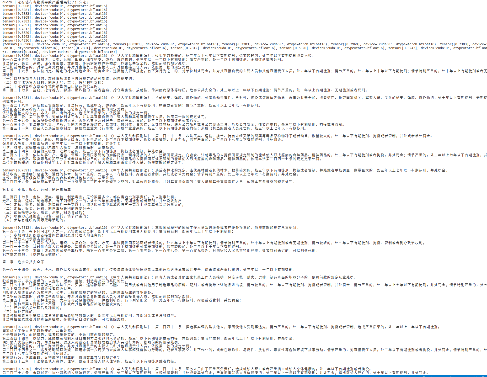
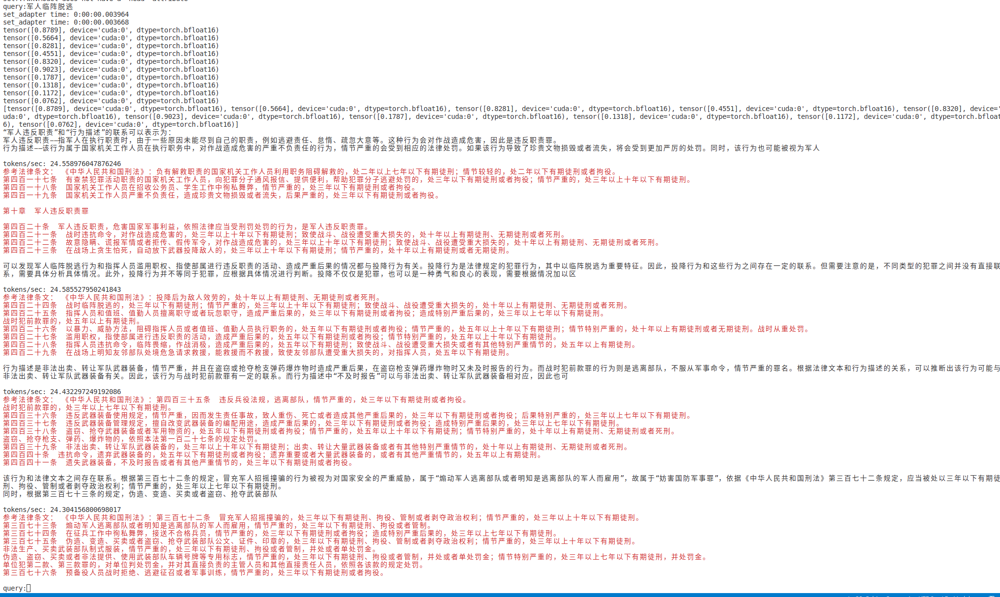

# Lora模型下载
链接: https://pan.baidu.com/s/1PA1lHNKCFPWDPEqhVvmSnQ?pwd=47m9 提取码: 47m9 复制这段内容后打开百度网盘手机App，操作更方便哦

# 基础模型
Lora微调用模型为RWKV51b5,回答模型也是为RWKV5 1B5,在加载的时候，三个模型公用一个基础模型。

# 样例数据

../sample_data 是几部法律文书

# 测试步骤

可以掠过0～3步的模型训练的过程，直接从百度王盘下载训练好的lora模型作为biencoder和crossencoder。

向量数据库使用chromadb，直接嵌入使用。

4_build_vdb.py 可以使用../sample_data目录作为输入目录，创建向量数据库。

5_query_vdb.py 使用建立好的向量数据库根据query 搜索参考文本。注意，这里使用了两个rwkv5作为基础模型，没有使用单一rwkv5参数。只是演示用，不可直接使用。

6_anwser_with_rag.py 一个完整的本地RAG应用。支持三个模型公用一个基础模型。

