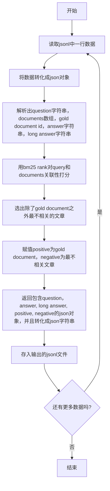

# 制作超长文本Cross Encoder训练数据

## 数据集

Query/Document数据集，用自然语言提问，返回选中的文档。

## 下载数据集

数据集为long_collection的自然语言提问数据集。具体链接为：
https://huggingface.co/datasets/togethercomputer/Long-Data-Collections/blob/main/fine-tune/natural_questions_10_200_docs.jsonl.zst

解压缩之后是一个jsonl文件。


## 0. 创建jsonl数据集
流程为：




运行脚本为：
```python
python long_ctx 0_create_q_p_n.py --input_file 下载的jsonl文件 --output_file 输出的包含query/positive/negative的jsonl --num_splits 多少个进程
```

这个程序用状态机实现了一个最简单的tokenizer/parser，多少个cpu就用多少个进程来做。个别在状态机之外的异常，就抛弃了，比例很低。

## 1. 创建datasets

这一步把jsonl转化成parquet格式的datasets，并且全部使用RWKV的TRIE_TOKENIZER转化成ids

```python
python long_ctx/1_create_datasets --input_file 上一步生成的jsonl文件 --output_dir 保存datsets的目录
```

## 2. 创建训练数据

这一步根据输入的参数，按照需要创建训练数据。

```python
python long_ctx/2_create_padded_data.py --ds_dir 上一部生成的目录 --max_length 最大长度 --sep_token_id 分离query和document的字符 --cls_token_id 总结字符 --is_truncate 是否对超过max-length的文章截断 --pad_token_id padding字符
```

# 创建完成之后，可以直接使用cross encoder下面的脚本进行训练

如：

```python
python cross_encoder/1_peft_training_ce.py --model_file /media/yueyulin/bigdata/models/rwkv5/RWKV-5-World-0.4B-v2-20231113-ctx4096.pth --ctx_len 8192 --bs 2 --ds_dir /media/yueyulin/KINGSTON/data/natural_questions_10_200_docs_q_p_n_tokenized_ds_padded_8192_cls_1_sep_2_truncate_False_pad_0/ --output_dir /media/yueyulin/bigdata/models/lora/rwkv04b/ce_att_ffn_8k --lora_ckpt /media/yueyulin/bigdata/models/lora/rwkv04b/ce_att_ffn_8k

```